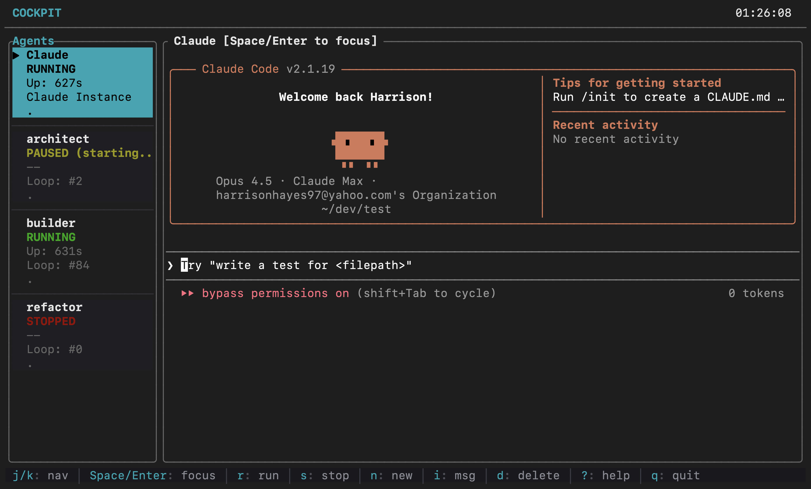

# Cockpit

A UI to Pilot AI Agents



## The Idea

The most capable AI agents aren't magic. They're loops.

```bash
while true; do
  cat PROMPT.md | claude --dangerously-skip-permissions
done
```

Give Claude a task, let it work, let it finish, repeat. This primitive scales further than you'd expect.

Cockpit gives you a workspace to run these loops, observe them, and iterate on them.

## Quick Start

### Prerequisites

- [Rust](https://rustup.rs/)
- [Claude Code CLI](https://docs.anthropic.com/en/docs/claude-code) — `npm install -g @anthropic-ai/claude-code`
- macOS or Linux

### Install

```bash
git clone https://github.com/Harrison97/cockpit
cd cockpit
make release
make install   # installs to /usr/local/bin
cockpit
```

Or build without installing:

```bash
make release
./target/release/cockpit
```

### Create an Agent

1. Press `n`
2. Enter the path to a codebase
3. Name it
4. Enter a prompt — or leave empty for a plain Claude session

Press `r` to run. Press `Space` to focus the terminal.

## Two Modes

**Claude Instances** — Leave the prompt empty. You get a standard Claude Code session. Useful for quick tasks or when you want to drive.

**Ralph Loops** — Enter a prompt. Claude works until it commits or says it's done, then restarts. Useful for larger tasks that benefit from iteration.

Even if you never touch Ralph loops, running one or two Claude sessions in cockpit beats wrestling with them in a normal terminal. Scrollback that actually works, pause and resume, persistent history, clean switching between sessions.

## Controls

| Key     | Action           |
| ------- | ---------------- |
| `j/k`   | Navigate agents  |
| `r`     | Run / resume     |
| `s`     | Stop             |
| `p`     | Pause            |
| `n`     | New agent        |
| `d`     | Delete           |
| `i`     | Import from disk |
| `Space` | Focus terminal   |
| `?`     | Help             |

When focused: `Tab` to go back, `Ctrl+F` to search, `Ctrl+C` to interrupt.

## The Lab

Everything lives in `.cockpit/`:

```
.cockpit/
├── state.json
├── agents/
│   └── my-agent/
│       ├── PROMPT.md
│       └── history.log
└── logs/
```

Each agent is just a directory with a prompt file. Edit it directly, version control it, copy it between projects.

History persists. Close cockpit, reopen it, scroll back through what happened.

## Going Further

The prompt is the agent. A well-crafted one can do more than you'd think.

You can pause a running agent, edit its prompt, and resume. You can point an agent at cockpit itself. You can use agents to build other agents.

How far this goes is up to you.

## Example: Research Agent

See `gastown.md` for an example of a long-running research agent. It maintains structured beliefs, tracks hypotheses, and iterates toward product clarity — all without writing code.

Create it:

1. Press `n`, point it at this repo
2. Paste the contents of `gastown.md` as the prompt
3. Press `r` to run

It will loop indefinitely, refining its understanding each iteration.

---

```bash
make build            # debug build
make release          # release build
make install          # install to /usr/local/bin
make uninstall        # remove from /usr/local/bin
cargo test
COCKPIT_LOG=debug cargo run  # verbose logging
```
